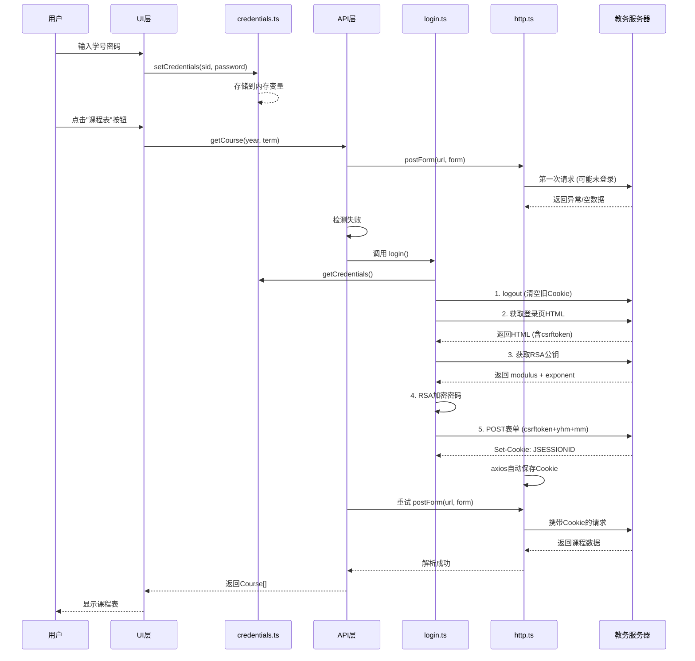

# JWXT 教务系统鉴权流程关键代码文档

> 福建工程学院教务系统移动端鉴权机制完整解析

**生成时间**: 2026-01-07
**项目**: jwxt-page (React Native + Expo)
**鉴权方式**: Cookie Session + RSA密码加密

---

## 📋 目录

1. [鉴权流程概览](#鉴权流程概览)
2. [核心代码模块](#核心代码模块)
3. [自动重试机制](#自动重试机制)
4. [安全改进建议](#安全改进建议)

---

## 🔐 鉴权流程概览

```
用户输入 → 凭证存储 → 自动登录 → Cookie会话 → API访问 → 自动重试
```

### 流程详解



---

## 📦 核心代码模块

### 1. 凭证存储 (`lib/jwxt/credentials.ts`)

```typescript
// TODO: 安全存储和获取
// ⚠️ 当前使用内存存储，应用重启后丢失，不安全

let currentSid = "";
let currentPassword = "";

/**
 * 设置用户凭证
 * @param sid - 学号
 * @param password - 密码（明文）
 */
export function setCredentials(sid: string, password: string) {
  currentSid = sid;
  currentPassword = password;
}

/**
 * 获取用户凭证
 * @returns { sid, password }
 */
export function getCredentials() {
  return { sid: currentSid, password: currentPassword };
}
```

**关键问题**:
- ❌ **明文存储**: 密码直接存储在内存变量中
- ❌ **无持久化**: 应用重启后需要重新输入
- ❌ **不安全**: 未使用加密存储

**推荐改进**:
```typescript
import * as SecureStore from 'expo-secure-store';

export async function setCredentials(sid: string, password: string) {
  await SecureStore.setItemAsync('jwxt_sid', sid);
  await SecureStore.setItemAsync('jwxt_password', password);
}

export async function getCredentials() {
  const sid = await SecureStore.getItemAsync('jwxt_sid') || '';
  const password = await SecureStore.getItemAsync('jwxt_password') || '';
  return { sid, password };
}
```

---

### 2. HTTP 客户端配置 (`lib/jwxt/http.ts`)

#### 2.1 自定义错误类

```typescript
/**
 * API 错误类
 * 规范化所有HTTP错误
 */
export class ApiError extends Error {
  status?: number;
  url?: string;
  data?: unknown;

  constructor(
    message: string,
    opts?: { status?: number; url?: string; data?: unknown }
  ) {
    super(message);
    this.name = "ApiError";
    this.status = opts?.status;
    this.url = opts?.url;
    this.data = opts?.data;
  }
}
```

#### 2.2 HTTP 工厂函数

```typescript
type CreateHttpOptions = {
  baseURL: string;
  timeoutMs?: number;
  makeReferer?: (pathOrReferer: string) => string;
};

type Extra = {
  referer?: string;
  headers?: Record<string, string>;
};

const UA = "Mozilla/5.0 (X11; Linux x86_64) AppleWebKit/537.36 (KHTML, like Gecko) Chrome/56.0.2924.87 Safari/537.36";

export function createHttp(opts: CreateHttpOptions) {
  const http: AxiosInstance = axios.create({
    baseURL: opts.baseURL,
    timeout: opts.timeoutMs ?? 15_000,
    withCredentials: true,  // 🔑 关键：自动管理Cookie
    validateStatus: (s) => s >= 200 && s < 400,
  });

  // ... 省略错误处理和请求方法
}
```

**关键配置**:
- `withCredentials: true` - **自动管理Cookie**，这是整个鉴权机制的核心
- `User-Agent` - 模拟浏览器请求
- `Referer` - 动态生成，防止CSRF检查失败

#### 2.3 请求封装

```typescript
async function rawRequest<T>(
  config: AxiosRequestConfig,
  extra?: Extra
): Promise<AxiosResponse<T>> {
  const referer = extra?.referer ?? config.url ?? "";
  const headers: Record<string, string> = {
    "User-Agent": UA,
    ...(extra?.headers ?? {}),
    ...(config.headers as any),
  };

  // 动态生成 Referer
  if (opts.makeReferer) headers.Referer = opts.makeReferer(referer);

  try {
    return await http.request<T>({ ...config, headers });
  } catch (e) {
    normalizeError(e);  // 统一错误处理
  }
}
```

#### 2.4 POST 表单方法

```typescript
async postForm<T>(
  url: string,
  form: URLSearchParams,
  extra?: Extra
): Promise<T> {
  return this.post<T>(url, form, {
    ...extra,
    headers: {
      Accept: "application/json, text/javascript, */*; q=0.01",
      "Content-Type": "application/x-www-form-urlencoded;charset=UTF-8",
      "X-Requested-With": "XMLHttpRequest",  // 标识为AJAX请求
      ...(extra?.headers ?? {}),
    },
  });
}
```

---

### 3. 客户端实例化 (`lib/jwxt/client.ts`)

```typescript
import { createHttp } from "./http";

/**
 * 全局HTTP客户端实例
 * 所有API调用都使用此实例
 */
export let http = createHttp({
  baseURL: process.env.EXPO_PUBLIC_JWXT_BASE_URL!,  // https://jwxtwx.fjut.edu.cn/jwglxt/
  makeReferer: (p) =>
    process.env.EXPO_PUBLIC_API_URL! + (p.startsWith("/") ? p.slice(1) : p)
});
```

**环境变量** (`.env`):
```env
EXPO_PUBLIC_JWXT_BASE_URL=https://jwxtwx.fjut.edu.cn/jwglxt/
EXPO_PUBLIC_API_URL=https://jwxtwx.fjut.edu.cn/jwglxt/
```

---

### 4. 登录流程 (`lib/jwxt/api/login.ts`)

#### 4.1 主登录函数

```typescript
import { http } from "@/lib/jwxt/client";
import forge from "node-forge";
import { getCredentials } from "../credentials";
import { logout } from "./logout";

/**
 * 登录教务系统
 * 流程: logout → 获取CSRF → 获取公钥 → 加密密码 → 提交表单
 */
export async function login(): Promise<void> {
  // 步骤1: 清空旧Cookie和会话
  await logout();

  // 步骤2: 获取凭证
  const { sid, password } = getCredentials();
  if (!sid || !password) throw new Error("请先设置学号和密码");

  // 步骤3: 获取登录页HTML，提取csrftoken
  const html = await http.getText("xtgl/login_slogin.html", {
    referer: "xtgl/login_slogin.html",
    headers: {
      Accept: "text/html,application/xhtml+xml,application/xml;q=0.9,image/webp,image/apng,*/*;q=0.8,application/signed-exchange;v=b3",
    },
  });

  const csrfToken =
    html.match(/id=["']csrftoken["'][^>]*value=["']([^"']+)["']/i)?.[1] || "";

  // 步骤4: 获取RSA公钥
  const pubkey = await http.get<{ modulus: string; exponent: string }>(
    "xtgl/login_getPublicKey.html",
    { referer: "xtgl/login_slogin.html" }
  );

  // 步骤5: RSA加密密码
  const encrypted = encryptPassword(
    password,
    pubkey.modulus,
    pubkey.exponent
  );

  // 步骤6: 构造表单
  const form = new URLSearchParams();
  form.set("csrftoken", csrfToken);
  form.set("yhm", sid);           // 用户名(学号)
  form.set("mm", encrypted);      // 加密后的密码

  // 步骤7: 提交登录请求
  const resp = await http.postForm<any>(
    "xtgl/login_slogin.html",
    form,
    { referer: "xtgl/login_slogin.html" }
  );

  // 步骤8: 检测登录结果
  const respText =
    typeof resp === "string"
      ? resp
      : resp
      ? JSON.stringify(resp)
      : "";

  if (respText.includes("用户名或密码不正确")) throw new Error("用户名或密码错误");
  if (respText.includes("验证码错误")) throw new Error("验证码错误");
  if (respText.includes("用户登录")) throw new Error("登录失败");

  // 成功时服务器返回 Set-Cookie: JSESSIONID=xxx
  // axios 的 withCredentials: true 会自动保存此Cookie
}
```

#### 4.2 RSA密码加密

```typescript
/**
 * 使用RSA公钥加密密码
 * @param password - 明文密码
 * @param modulus - Base64编码的模数
 * @param exponent - Base64编码的指数
 * @returns Base64编码的加密密文
 */
function encryptPassword(
  password: string,
  modulus: string,
  exponent: string
): string {
  // 1. 将Base64公钥转为BigInteger
  const n = new forge.jsbn.BigInteger(
    forge.util.bytesToHex(forge.util.decode64(modulus)),
    16
  );
  const e = new forge.jsbn.BigInteger(
    forge.util.bytesToHex(forge.util.decode64(exponent)),
    16
  );

  // 2. 构造RSA公钥
  const publicKey = forge.pki.setRsaPublicKey(n, e);

  // 3. 使用PKCS1 v1.5填充加密
  return forge.util.encode64(publicKey.encrypt(password, "RSAES-PKCS1-V1_5"));
}
```

**加密流程**:
```
明文密码 → Base64公钥解码 → 构造RSA公钥 → PKCS1加密 → Base64编码 → 加密密文
```

**为什么使用RSA加密**:
- ✅ 保护密码在网络传输中不被明文截获
- ✅ 每次登录使用不同的公钥，防止重放攻击
- ✅ 服务器用私钥解密，安全性高

---

### 5. 登出流程 (`lib/jwxt/api/logout.ts`)

```typescript
import { http } from "@/lib/jwxt/client";

/**
 * 登出教务系统
 * 清空服务器端的会话Cookie
 */
export async function logout(): Promise<void> {
  const url = "logout";
  const referer = "xtgl/index_initMenu.html";
  await http.post<any>(url, { referer });

  // axios 会自动处理服务器返回的 Set-Cookie: JSESSIONID=; expires=...
  // Cookie被设置为过期，后续请求不再携带
}
```

---

## 🔄 自动重试机制

所有需要鉴权的API都实现了**自动登录重试**机制，用户体验无感知。

### 示例1: getCourse (获取课程表)

```typescript
// 文件: lib/jwxt/api/getCourse.ts

export async function getCourse(
  year: number = new Date().getFullYear(),
  term: number = 1
): Promise<Course[]> {
  const startDate = getStartDate(year, term);
  const referer = "kbcx/xskbcx_cxXsKb.html?gnmkdm=N2151";
  const url = "kbcx/xskbcx_cxXsgrkb.html";

  const form = new URLSearchParams();
  form.set("xnm", year.toString());
  form.set("xqm", term.toString());
  form.set("kzlx", "ck");

  // 🔑 第一次尝试
  let data: any = await http.postForm<any>(url, form, { referer });

  // 🔑 检测失败（未登录或会话过期）
  if (!data || typeof data !== "object") {
    await login();  // 自动登录
    data = await http.get<any>(url, { referer });  // 重试
  }

  // 第二次仍失败则抛出错误
  if (!data || typeof data !== "object") {
    throw new Error("获取信息失败:返回格式异常");
  }

  // 解析数据...
  return parseCourses(data, startDate);
}
```

### 示例2: getExam (获取考试安排)

```typescript
// 文件: lib/jwxt/api/getExam.ts

export async function getExam(
  year: number = new Date().getFullYear(),
  term: number = 1
): Promise<Exam[]> {
  const referer = "kwgl/kscx_cxXsksxxIndex.html?doType=query&gnmkdm=N358105";
  const url = "kwgl/kscx_cxXsksxxIndex.html?doType=query&gnmkdm=N358105";

  const form = new URLSearchParams();
  form.set("xnm", year.toString());
  form.set("xqm", term.toString());

  // 🔑 第一次尝试
  let data: any = await http.postForm<any>(url, form, { referer });

  // 🔑 自动重试机制
  if (!data || typeof data !== "object") {
    await login();
    data = await http.get<any>(url, { referer });
  }

  if (!data || typeof data !== "object") {
    throw new Error("获取信息失败:返回格式异常");
  }

  // 解析数据...
  return parseExams(data);
}
```

### 示例3: getInfo (获取个人信息)

```typescript
// 文件: lib/jwxt/api/getInfo.ts

export async function getInfo(): Promise<StudentInfo> {
  const referer = "xsxxxggl/xsgrxxwh_cxXsgrxx.html?gnmkdm=N100801";
  const url = "xsxxxggl/xsgrxxwh_cxXsgrxx.html?gnmkdm=N100801";

  // 🔑 第一次尝试
  let data: any = await http.get<any>(url, { referer });

  // 🔑 自动重试机制
  if (!data || typeof data !== "object") {
    await login();
    data = await http.get<any>(url, { referer });
  }

  if (!data || typeof data !== "object") {
    throw new Error("获取信息失败:返回格式异常");
  }

  // 解析数据...
  return parseStudentInfo(data);
}
```

### 重试机制优势

✅ **用户无感知**: 登录过程完全透明
✅ **自动恢复**: 会话过期自动重新登录
✅ **简化逻辑**: UI层无需关心鉴权状态
✅ **一致性**: 所有API使用统一的重试模式

---

## 🔑 Cookie会话管理

### Cookie流转过程

```
1. 用户登录成功
   ↓
2. 服务器返回 Set-Cookie: JSESSIONID=ABC123; Path=/; HttpOnly
   ↓
3. axios (withCredentials: true) 自动保存Cookie
   ↓
4. 后续所有请求自动携带: Cookie: JSESSIONID=ABC123
   ↓
5. 服务器验证Cookie，返回数据
   ↓
6. 会话过期或登出时，Cookie失效
   ↓
7. 下次请求失败，触发自动登录
```

### 为什么使用Cookie而非Token

| 特性 | Cookie | JWT Token |
|------|--------|-----------|
| **管理方式** | 浏览器/axios自动 | 需手动存储和携带 |
| **存储位置** | HTTP层自动管理 | 需存储在AsyncStorage/SecureStore |
| **请求携带** | 自动 | 需手动添加 Authorization 头 |
| **过期处理** | 服务器控制 | 需客户端解析和刷新 |
| **实现复杂度** | 低 | 中 |

**本项目选择Cookie的原因**:
- ✅ 教务系统后端本身使用Cookie会话
- ✅ axios的 `withCredentials: true` 零配置管理
- ✅ 无需实现Token存储、刷新逻辑
- ✅ 符合Web标准，兼容性好

---

## 📊 完整鉴权时序图

```
用户操作                    内存          API层              HTTP层           服务器
   |                        |             |                  |                |
   |--输入学号密码----------->|             |                  |                |
   |                        |             |                  |                |
   |                   setCredentials()   |                  |                |
   |                        |--存储------->|                  |                |
   |                        |             |                  |                |
   |--点击"课程表"---------------------------->getCourse()    |                |
   |                        |             |                  |                |
   |                        |             |--postForm()----->|                |
   |                        |             |                  |--POST-------->|
   |                        |             |                  |<--401/空数据---|
   |                        |             |<--检测失败-------|                |
   |                        |             |                  |                |
   |                        |             |--login()-------->|                |
   |                        |<--getCredentials()             |                |
   |                        |--返回sid,pwd-->|               |                |
   |                        |             |                  |--POST logout->|
   |                        |             |                  |<--清空Cookie---|
   |                        |             |                  |                |
   |                        |             |                  |--GET 登录页--->|
   |                        |             |                  |<--HTML+csrf---|
   |                        |             |                  |                |
   |                        |             |                  |--GET 公钥----->|
   |                        |             |                  |<--modulus+exp--|
   |                        |             |                  |                |
   |                        |             |--RSA加密密码---->|                |
   |                        |             |                  |                |
   |                        |             |                  |--POST 表单---->|
   |                        |             |                  |<--Set-Cookie---|
   |                        |             |                  | (JSESSIONID)   |
   |                        |             |                  |                |
   |                        |             |<--登录成功-------|                |
   |                        |             |                  |                |
   |                        |             |--重试postForm()->|                |
   |                        |             |                  |--POST+Cookie-->|
   |                        |             |                  |<--课程数据-----|
   |                        |             |<--解析数据-------|                |
   |<--显示课程表------------------------------|             |                |
```

---

## ⚠️ 安全改进建议

### 当前存在的安全问题

#### 1. 凭证存储不安全 (高危)

**问题**:
```typescript
// credentials.ts
let currentPassword = "";  // ❌ 明文存储在内存中
```

**风险**:
- 内存泄漏可能导致密码泄露
- 应用重启后需要重新输入
- 调试工具可直接查看内存变量

**解决方案**:
```typescript
// 安装依赖
npm install expo-secure-store

// 改进后的 credentials.ts
import * as SecureStore from 'expo-secure-store';

export async function setCredentials(sid: string, password: string) {
  await SecureStore.setItemAsync('jwxt_sid', sid);
  await SecureStore.setItemAsync('jwxt_password', password);
}

export async function getCredentials() {
  const sid = await SecureStore.getItemAsync('jwxt_sid') || '';
  const password = await SecureStore.getItemAsync('jwxt_password') || '';
  return { sid, password };
}

export async function clearCredentials() {
  await SecureStore.deleteItemAsync('jwxt_sid');
  await SecureStore.deleteItemAsync('jwxt_password');
}
```

**SecureStore 优势**:
- ✅ iOS: 存储到 Keychain (硬件加密)
- ✅ Android: 存储到 EncryptedSharedPreferences
- ✅ 应用重启后数据持久化
- ✅ 自动加密，无需手动管理密钥

#### 2. 缺少请求签名 (中危)

**问题**: 请求可被中间人篡改

**解决方案**:
```typescript
// 添加请求签名
import CryptoJS from 'crypto-js';

function signRequest(params: Record<string, any>, secret: string): string {
  const sorted = Object.keys(params).sort().map(k => `${k}=${params[k]}`).join('&');
  return CryptoJS.HmacSHA256(sorted, secret).toString();
}
```

#### 3. 缺少证书校验 (中危)

**问题**: HTTPS连接可能被中间人攻击

**解决方案**:
```typescript
// 添加证书固定 (Certificate Pinning)
import { Platform } from 'react-native';

const EXPECTED_CERT_HASH = 'sha256/AAAAAAAAAAAAAAAAAAAAAAAAAAAAAAAAAAAAAAAAAAA=';

// 在生产环境启用证书校验
if (Platform.OS === 'ios') {
  // iOS: 使用 NSURLSession 的 SSL Pinning
}
```

#### 4. 无请求频率限制 (低危)

**问题**: 可能被恶意利用进行暴力破解

**解决方案**:
```typescript
// 添加请求频率限制
class RateLimiter {
  private timestamps: number[] = [];

  canProceed(maxRequests: number, windowMs: number): boolean {
    const now = Date.now();
    this.timestamps = this.timestamps.filter(t => now - t < windowMs);

    if (this.timestamps.length >= maxRequests) {
      return false;
    }

    this.timestamps.push(now);
    return true;
  }
}

// 使用
const loginLimiter = new RateLimiter();
if (!loginLimiter.canProceed(5, 60000)) {
  throw new Error('登录请求过于频繁，请稍后再试');
}
```

---

## 📚 使用示例

### 完整的登录到数据获取流程

```typescript
// 1. 首页 - 用户输入凭证
// app/index.tsx
import { setCredentials } from '@/lib/jwxt/credentials';

export default function HomeScreen() {
  const [sid, setSid] = useState('');
  const [password, setPassword] = useState('');

  const handleSave = () => {
    setCredentials(sid, password);
    alert('凭证已保存');
  };

  return (
    <View>
      <TextInput placeholder="学号" value={sid} onChangeText={setSid} />
      <TextInput placeholder="密码" value={password} onChangeText={setPassword} secureTextEntry />
      <Button title="保存凭证" onPress={handleSave} />
    </View>
  );
}

// 2. 课程表页面 - 自动登录和获取数据
// app/course-modal.tsx
import { useFetchCourse } from '@/hooks/useFetchCourse';

export default function CourseModal() {
  const { courses, error, loading, onReload } = useFetchCourse(2025, 1);

  return (
    <View>
      <Button title="刷新" onPress={onReload} disabled={loading} />

      {loading && <ActivityIndicator />}
      {error && <Text style={{ color: 'red' }}>{error}</Text>}
      {courses && courses.map(course => (
        <View key={course.kch}>
          <Text>{course.kcmc}</Text>
          <Text>{course.teacher}</Text>
        </View>
      ))}
    </View>
  );
}

// 3. Hook层 - 封装数据获取逻辑
// hooks/useFetchCourse.ts
import { useState, useEffect, useCallback } from 'react';
import { getCourse } from '@/lib/jwxt/api/getCourse';

export function useFetchCourse(year: number, term: number) {
  const [courses, setCourses] = useState<Course[] | null>(null);
  const [error, setError] = useState<string | null>(null);
  const [loading, setLoading] = useState(false);

  const fetchInfo = useCallback(async () => {
    setLoading(true);
    setError(null);
    try {
      const data = await getCourse(year, term);  // 自动登录在这里发生
      setCourses(data);
    } catch (e: any) {
      setError(e?.message ?? '获取课程失败');
    } finally {
      setLoading(false);
    }
  }, [year, term]);

  useEffect(() => {
    fetchInfo();
  }, [fetchInfo]);

  return { courses, error, loading, onReload: fetchInfo };
}
```

---

## 🎯 总结

### 鉴权机制特点

| 特性 | 实现方式 | 优势 |
|------|----------|------|
| **会话管理** | Cookie (JSESSIONID) | 自动化，零配置 |
| **密码传输** | RSA PKCS1 加密 | 防止明文截获 |
| **CSRF防护** | csrftoken动态获取 | 防止跨站请求伪造 |
| **自动重试** | API层统一实现 | 用户体验无感知 |
| **错误处理** | ApiError规范化 | 统一错误格式 |

### 关键文件清单

```
lib/jwxt/
├── credentials.ts        # 凭证存储 (需改进)
├── http.ts              # HTTP封装 (Cookie管理核心)
├── client.ts            # 客户端实例
└── api/
    ├── login.ts         # 登录逻辑 (RSA加密)
    ├── logout.ts        # 登出逻辑
    ├── getCourse.ts     # 课程API (含自动重试)
    ├── getExam.ts       # 考试API (含自动重试)
    └── getInfo.ts       # 个人信息API (含自动重试)
```

### 优先改进事项

1. ✅ **立即执行**: 使用 `expo-secure-store` 替换内存存储
2. ⚠️ **短期执行**: 添加请求频率限制
3. 📝 **长期考虑**: 实现证书固定和请求签名

---

**文档生成时间**: 2026-01-07
**最后更新**: 2026-01-07
**维护者**: AI Generated
**版本**: 1.0.0
